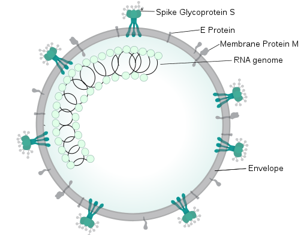
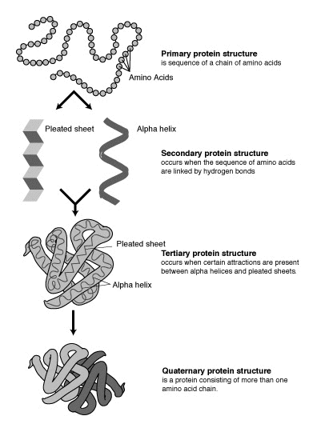
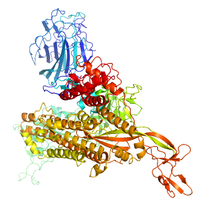

## Study on the Novel Coronavirus in Python

### Requirements
- Python3
- Jupyter Notebook
- nglview
- openmm
- pytraj (Available only for Linux and MAC OSX) - Used to visualize MD simulations
- For windows recommended to use PyMol for visualization

### Resources
- SARS-CoV-2 Genom is made public for researcher and scientists to collaborate. There are many genomes available, but in this study the genome was collected from https://www.ncbi.nlm.nih.gov/nuccore/NC_045512 
- Protein Strucutres of SARS-CoV-2 can be found on https://zhanglab.ccmb.med.umich.edu/C-I-TASSER/2019-nCov/
- https://www.ncbi.nlm.nih.gov/pmc/articles/PMC6407873/
- https://www.annualreviews.org/doi/pdf/10.1146/annurev.physchem.58.032806.104614
- https://www.uniprot.org/

### SARS
- SARS-CoV-2 is the new ccoronavirus that has led to worst pandemic in recent history. Many researchers are trying to find vaccine and other possible sure for this virus. Previously SARS Coronavirus was deteted which had almost same sysmtoms
- SARS (Severe Acute Respiratory Sydrome) Coronavirus infects the epithilial cells within the lungs. Epithilial tissues line the outer surfaces of organs and blood vessels throght the boody and also inner surfaces of many cavities
- SARS virus enters the body through ACE2 receptors and the symptoms are muscle pain, head ache, fever followed in 2-14 days and respiratory problems mainly cough, dyspnea (shortness of breath) and pnuemonia.
- Pnuemonia is a inflamation condition of lungs which primarily effect the alvioli. 

### SARS-CoV-2
- Genome size of Coronaviruses is one of the largest among RNA Viruses. Its about 17- 34 Kilobases (1 Kilobases = 1000 base pairs) 
- SARS-Cov2 is approximately 50-200 nm in diameter. SARS-Cov-2 like other coronaviruses it has four protiens, Spike (S), Envelope (E), Membrane (M), Nucleocapsid (N), The N protein holds the RNA Genome while the S, M and E protein together create the Viral Envelope
- Viral envelope is the outer layer of many viruses including SARS-CoV-2. The lipid bilayer envelope of these viruses are sensitive to heat, dryness, detergent. Hence Washing hands with soap will kill the virus
- the Spike (S) protein is responisble for alowing the virus to be attach and fuse with the membrane of the host cell. Initial spike protein priming by transmembrane protease, serine 2 (TMPRSS2) is essential for entry of SARS-CoV-2. After a SARS-CoV-2 virion attaches to a target cell, the cell's protease TMPRSS2 cuts open the spike protein of the virus, exposing a fusion peptide. The virion then releases RNA into the cell, forcing the cell to produce copies of the virus that are disseminated to infect more cells
- Tetherin is protein whose function blocks the release of HIV-1 viral particeles. And ORF7a protien in SARS-CoV-2 supresses the host tetherin activity. This is the reason researchers tried HIV drugs on COVID-19 patients
- N protein of the SARS-CoV-2 packages the positve strand RNA genome into a helical ribonucleocapsid

### Copmutaional Methdos to help understand the virus
- Genome of the virus can be very useful to predict its functionalities. Genom of the virus can be converted into proteins using compuational methods. The genome of SARS-CoV-2 is a positive-sense-single-stranded RNA virus. So it can be directly translated into chains of amino acids know as protein sequnece. This protein sequence is useful to predict the proteins structures and their functionalities. 
- Proteins are chains of amino acids bonded together by peptide bonds and Protein strucutre can be considered as a sequence of secondary strucutre elements like alpha helices and beta sheets, which together forms the three dimensional protein structure
- The secondary strucutres are tightly packed in the protein core in a hydrophobic environment (Repel Water) Each amino acid side group has a limited volume to occupy and a limited number of possible interactions with other nearby side chains, a situation that must be taken into account in molecular modeling and alignments
- FASTA format is used for representing amino-acid sequences
- Prediction of protein structure from the amino acids sequence is one of the toughest probelems in copmuational science. The three dimensional structure of the protein is too complicated and needs a lot of computational power to run the simulations. 
- There are many ways to proceed to get a protein strucutre. Homology, fold regonition and Molecular Dynamics simulations to model the folding

Corona Virus Spike Protein

### Vaccine
- Vaccines work by building the immune system by letting in antigens of the pathogens (virus or bacteria) into body so that the immune system can learn fight against the virus. The immune system can safely learn to recogninze them and produce antibodies so that later when the immune system detects the virus it can attack rapidly by relaesing anti bodies

#### Types of Vaccines
- Live Attenuated vaccines: Live pathogen of weaker form are injected into body so that the body's immune system can learn how to fight against it. It is a very good simulation for the immune system to learn but it is not recommended to give to pateients with weak immunity
- Innactivated Vaccines: Specific virus is killed and the dead cells are injected into the body. Even though they are dead the immune system can still learn how to fight against them
- Conjugate Vaccines: Specific protien from the pathogen that when injected the immune system can learn
- DNA Vaccines: injection with genetically engineered plasmid containing the DNA sequence encoding the antigen(s) against which an immune response is sought so cells directly produce an antibody, producing a protective immunological response.